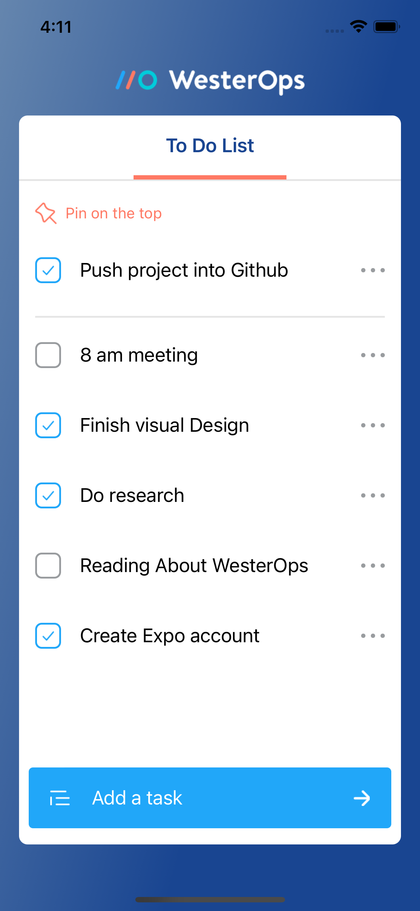

# westerOps_challenge

The task is to design and developed  using a React Native, which aims to display 'To Do List'.

# main features:
* Create new todo
* Remove todo
* Update todo
* Delete todo
* Pin the todo

# To get start it
- clone the repo to your local 

- open the command line in the root directory and run:
`yarn install`

-  then, run the command expo start, this step requires expo cli to run the app 
 `expo start`

# screenshot

